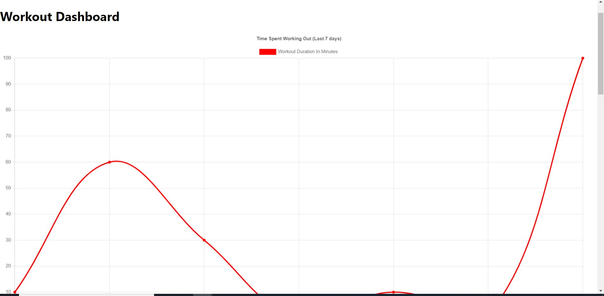

# Project Title

- **Title:** Fitness Tracker
  This is a homework for University of Oregon coding bootcamp. Learning how to create a fitness tracker using MongoDB and Mongoose as a Nosql database

## Installation

- **Installation Instruction:**
- npm i
- npm start - to start in localhost3000

## Screenshots

## Video Link

https://boiling-badlands-36576.herokuapp.com/?id=60a5f17852cde00015ef74ef

## Contributing

- **Github User Link:** goldreb

## Contact Information

- **Email:** gorebollido@gmail.com
